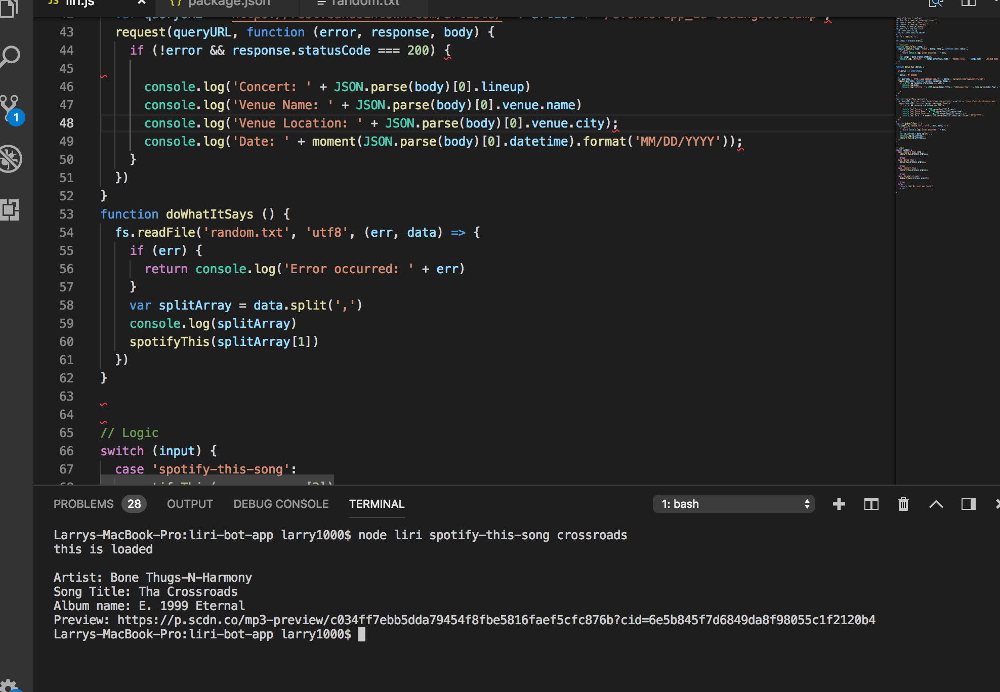

# liri-bot-app
In this applicatipn, I have created LIRI. LIRI is like iPhone's SIRI. However, while SIRI is a Speech Interpretation and Recognition Interface, LIRI is a Language Interpretation and Recognition Interface. LIRI is a command line node app that takes in parameters and gives you back data. With LIRI you can search band concert information, search song names that will return all of the songs information and give you movie information by title.

